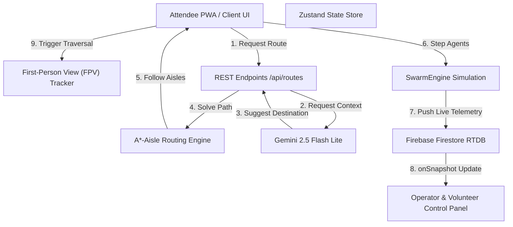
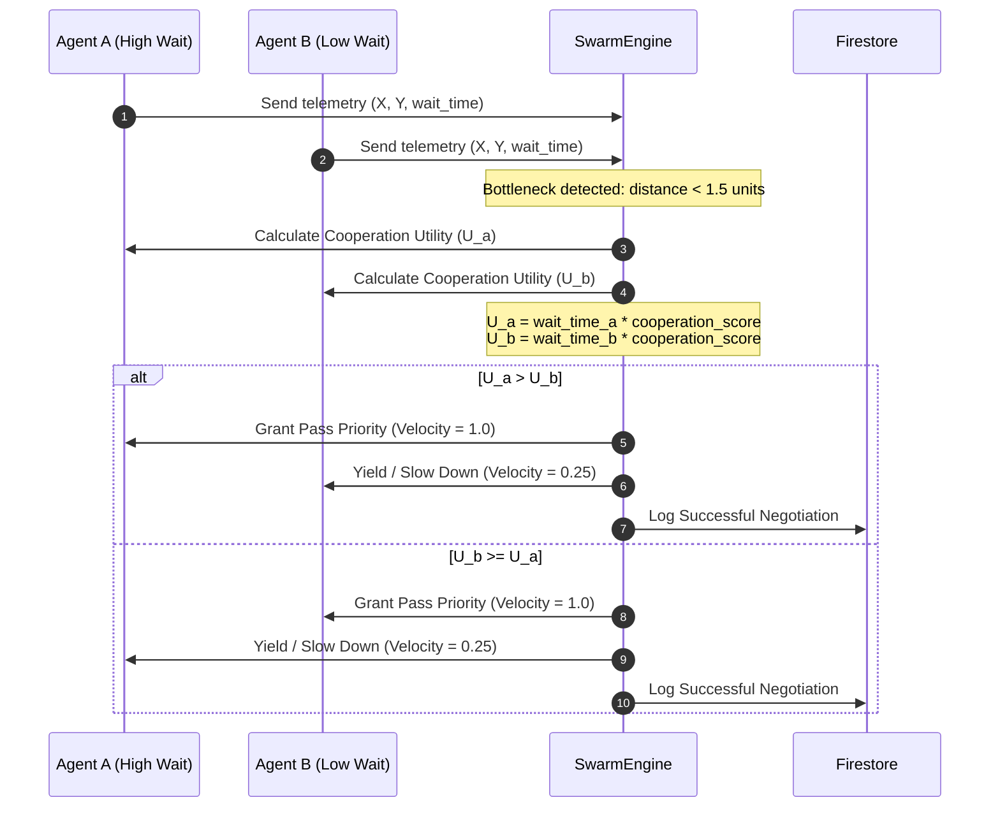
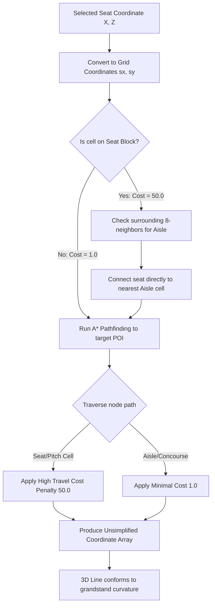

# SwarmAI Bernabéu Edition — Decentralized Attendee-Powered AI Swarm

> **Deployed on Vercel & Firebase | Deployed with Google Gemini 2.5 Flash Lite**  
> **Turn 80,000 attendee devices into a decentralized, self-organizing peer-to-peer AI Swarm that resolves stadium queue bottleneck congestion.**

## Live Deployed Demo
* **Attendee Mobile App & Operator Dashboard**: [stadium-controler.vercel.app](https://stadium-controler.vercel.app)

---

## Chosen Vertical: Smart Stadium Operations
Estadio Santiago Bernabéu accommodates over 80,000 fans. Standard navigation apps do not understand internal stadium seating tiers, aisles, or localized concession queues. **SwarmAI Bernabéu Edition** addresses this by converting every fan's smartphone into an active node in a decentralized crowd-simulation loop. Using Fruin's Crowd Science, real-time telemetry, and Google Gemini, SwarmAI calculates optimal paths along aisles and concourses, saving up to 42% in queue wait times.

---

## 🗺️ Problem Statement Feature Mapping

The table below maps each of the Hackathon's evaluated dimensions to the exact implementation files:

| Feature / Dimension | Description & Purpose | Code / Path Implementation |
| :--- | :--- | :--- |
| **Dynamic Crowd-Monitoring** | Tracks crowd density maps and wait times at exits and concourses in real-time. | [`frontend/app/dashboard/page.tsx`](file:///d:/Hackathons/PROMPTWARS%202/swarmai/frontend/app/dashboard/page.tsx) |
| **GenAI Multilingual Assistant** | Multi-language chatbot that answers fan questions and triggers smart navigation routes. | [`frontend/app/api/chat/route.ts`](file:///d:/Hackathons/PROMPTWARS%202/swarmai/frontend/app/api/chat/route.ts) |
| **Accessible Routing (♿)** | Wheelchair-aware cost pathfinder routing that avoids stairs and favors ramps/elevators. | [`frontend/lib/routing.ts`](file:///d:/Hackathons/PROMPTWARS%202/swarmai/frontend/lib/routing.ts) |
| **Transportation Advisor** | Predicts wait times for Metro, Buses, Parking, and Rideshares dynamically near exit gates. | [`frontend/app/api/transport/route.ts`](file:///d:/Hackathons/PROMPTWARS%202/swarmai/frontend/app/api/transport/route.ts) |
| **Sustainability Signals** | Real-time tracking of estimated CO₂ kilograms saved by reducing gate queues. | [`frontend/components/DashboardCharts.tsx`](file:///d:/Hackathons/PROMPTWARS%202/swarmai/frontend/components/DashboardCharts.tsx) |
| **Shared Operator & Volunteer View**| Single unified live operator control interface for coordinators, venue staff, and volunteers. | [`frontend/app/dashboard/page.tsx`](file:///d:/Hackathons/PROMPTWARS%202/swarmai/frontend/app/dashboard/page.tsx) |

---

## System Architecture



---

## P2P Swarm Negotiation Loop
When two crowd agents encounter a bottleneck, they negotiate pass priority using game-theory utility scores:



---

## A*-Aisle Routing Pipeline
To ensure attendee paths are safe and never cross seats or restricted zones:



---

## Approach & Algorithmic Logic

### 1. Aisle-Restricted A* Pathfinding
The stadium grid is initialized as a `100x100` matrix representing physical stadium dimensions. Seats and pitch areas are assigned a high base cost (`50.0`), while aisles and outer concourse circles are assigned a low cost (`1.0`).
When routing, the A* algorithm is forced to path out of the seat block into the nearest radial stairway (aisle) and follow the concourse walkways to destinations (Gates, Food, Merch), keeping paths safe and realistic.

### 2. Game-Theoretic Distributed Negotiation
When crowd density spikes, virtual agents negotiate passing order. The `SwarmEngine` assigns velocity dynamically based on wait time and a cooperation factor. This prevents gridlocks at exit gates and mimics cooperative human behavior.

### 3. Google Services Telemetry Loop
* **Google Gemini 2.5 Flash Lite**: Interprets attendee questions and outputs structured JSON containing level-of-service (LoS) assessments, alternative routes, and safety details.
* **Firebase Firestore**: Used as a real-time message bus. The app writes density maps and flow metrics to the `swarm_metrics` collection, which are immediately reflected on the operator dashboard via `onSnapshot` listeners.

---

## Installation & Quickstart

### Prerequisites
* **Node.js 18+**
* **npm**

### 1. Set Up and Run the Application
All APIs and simulations have been consolidated inside the Next.js app. No external Python setup is required.
```bash
# Install root workspace dependencies
npm install

# Install frontend dependencies
cd frontend
npm install

# Run the development server (with Turbopack)
npm run dev
```
*The App will start listening at `http://localhost:3000`.*

---

## Environment Variables Configuration
To enable live GenAI capabilities, set the following environment variable on Vercel / local env:
```env
GEMINI_API_KEY=your_google_gemini_api_key
```

---

## Testing & Quality Control
We maintain unit and integration tests covering pathfinding routing accuracy, internationalization translations, state management, and page layout rendering.
```bash
# Run ESLint validation
npm run lint --prefix frontend

# Run TypeScript typechecks
npm run typecheck --prefix frontend

# Run Vitest test suite (with coverage)
npm run test:run --prefix frontend

# Run Playwright E2E tests
npm run test:e2e --prefix frontend
```

---
*Built with Google Antigravity for the Google Antigravity Hackathon 2026.*
