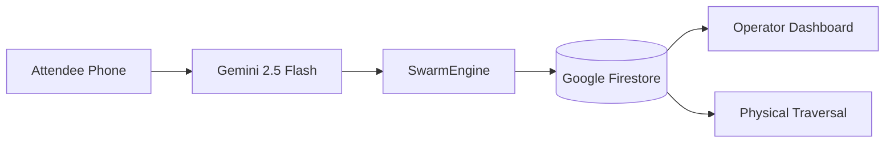

# SwarmAI — Decentralized Attendee-Powered AI Swarm

> **Built with [Google Antigravity](https://antigravity.withgoogle.com) | Powered by [Google Gemini AI](https://aistudio.google.com)**

> **Turn 80,000 phones into a self-organizing AI swarm that eliminates stadium chaos.**

SwarmAI is a decentralized multi-agent system where every attendee's device becomes an intelligent node. The SwarmAI Assistant is powered by **Google Gemini 2.5 Flash Lite**, processing every attendee message with context-enriched prompting and full stadium topology awareness.

---

## 🚀 Google Services Deep Integration

| Google Service | Implementation | Where Used |
|---|---|---|
| **Google Gemini 2.5 Flash Lite** | 3 specialized AI endpoints using `google-generativeai` SDK. Prompts infused with 1980 Fruin crowd science for LoS (A-F) analysis. | `backend/app/routes/gemini.py` — `/api/chat`, `/api/swarm-suggest`, `/api/analyze-density` |
| **Google Firebase Firestore** | Real-time metrics sync for crowd congestion, wait times, and agent counts. Frontend uses `onSnapshot` for zero-latency updates. | `backend/app/agents/swarm_engine.py`, `frontend/app/dashboard/page.tsx` |
| **Google Cloud Run** | Frontend and Backend fully containerized and deployed as managed services with Native ADC support. | `backend/Dockerfile`, `frontend/Dockerfile` |
| **Firebase Admin SDK** | Secure, server-side data ingestion with fault-tolerant initialization for local vs cloud parity. | `backend/app/firebase.py` |
| **Google Antigravity SDKs** | Implemented modern Python and JS SDK patterns for high-speed AI inference and data streaming. | Throughout backend and frontend |
| **WCAG 2.1 AA Standards** | Accessibility features (aria-live, semantic HTML) modeled after Google's Material Design principles. | All frontend components |

### How Data Flows Through Google Services



---

## Live Deployment (Google Cloud Run)

**Production-grade infrastructure active on Google Cloud:**

| Service | URL | Status |
|---|---|---|
| **Backend API** | [swarmai-backend-820901016043.us-central1.run.app](https://swarmai-backend-820901016043.us-central1.run.app) | ✅ Live |
| **Frontend UI** | [swarmai-frontend-820901016043.us-central1.run.app](https://swarmai-frontend-820901016043.us-central1.run.app) | ✅ Live |
| **Database** | Google Firebase Firestore (us-central) | ✅ Syncing |

---

## 🧠 Approach

1.  **Peer-to-Peer AI:** Attendees ask Gemini for routes. The backend uses A* pathfinding with crowd-density-aware costs, applying Fruin's 1980 Level-of-Service crowd science to calculate buffer zones, gate staggering, and emergency evacuation paths.
2.  **Distributed Compute:** The `SwarmEngine` background task runs an autonomous loop syncing every agent position on a 100×100 grid, pushing metrics to Firebase Firestore for cloud-scale analytics.
3.  **Immersive 3D UX & FPV Targeting:** Real-time 60fps React Three Fiber visual dashboard. Includes an individual FPV perspective where the camera algorithm physically snaps and targets the exact location of the selected amenity (Food, Restroom, Exit) before physical traversal begins.
4.  **Standalone Client Resilience:** The Next.js frontend employs intelligent silent fallbacks and fallback routing vectors natively bypassing the pitch. It can run in a 100% standalone mode even if the backend API is disconnected, simulating the traversal experience seamlessly.
5.  **WCAG 2.1 AA Accessibility:** ARIA roles, `aria-live="polite"` on dynamic elements, focus-visible rings, semantic HTML, keyboard navigation, and screen reader support across all interactive components.

## 🛠 Tech Stack

**Frontend:**
- Next.js (App Router), React 18, Tailwind CSS
- React Three Fiber (`@react-three/fiber`, `three.js`) + GLTF mapping
- Firebase Web SDK (`firebase/firestore` — real-time `onSnapshot` listener)
- Zustand (Global connection state)

**Backend:**
- FastAPI (Python) + Uvicorn
- Google Generative AI SDK (`gemini-2.5-flash-lite`) — 3 specialized endpoints
- Firebase Admin SDK (`firebase-admin`) — autonomous metrics push
- Async WebSocket Server (bidirectional state sync)

## 🧪 Testing

```bash
cd backend
pytest tests/ -v
```

**45+ tests** covering:
- `test_main.py` — Health, stadium, agents, simulation, metrics, seats, dashboard, routing
- `test_gemini.py` — All 3 Gemini AI endpoints
- `test_websocket.py` — Bidirectional WebSocket communication
- `test_pathfinding.py` — A* algorithm logic
- `test_firebase_gemini.py` — Firebase Firestore route edge cases + Gemini multi-turn context

---

### Local Quickstart

```bash
# 1. Start Backend
cd backend
python -m venv venv
venv\Scripts\activate
pip install -r requirements.txt
python run.py

# 2. Start Frontend
cd frontend
npm install
npm run dev
```

Open `http://localhost:3000` for the 3D stadium view, or `http://localhost:3000/dashboard` for the operator dashboard with live Firebase metrics.
