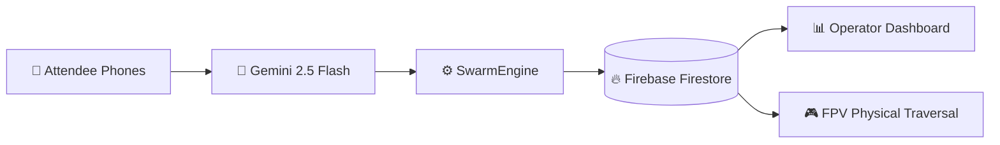

# SwarmAI Bernabéu Edition — Decentralized Attendee-Powered AI Swarm

> **Built with [Google Antigravity](https://antigravity.withgoogle.com) | Powered by [Google Gemini AI](https://aistudio.google.com)**  
> **Turn 80,000 phones into a self-organizing AI swarm that eliminates stadium chaos.**

SwarmAI is a decentralized multi-agent system where every attendee’s device becomes an intelligent node. The SwarmAI Assistant, powered by **Google Gemini 2.5 Flash Lite**, delivers context-aware routing and crowd management using full stadium topology and 1980 Fruin Crowd Science.

---

## 🚀 Google Services Deep Integration

SwarmAI features a **true closed-loop real-time AI swarm system** powered by multiple Google services working together:

| Google Service                        | Implementation Details |
|---------------------------------------|------------------------|
| **Google Gemini 2.5 Flash Lite**      | 3 intelligent endpoints (`chat`, `swarm-suggest`, `density-analysis`) with rich Fruin Crowd Science (LoS A–F) prompts, structured JSON outputs (`los_grade`, `reasoning`, `avoid_zones`, `safety_note`, `estimated_time`), and multi-turn context |
| **Firebase Firestore**                | Backend `SwarmEngine` **actively pushes live telemetry every 8 simulation ticks** (`total_agents`, `global_congestion`, `avg_wait_seconds`, `active_nodes`, `heatmap`, `los_grade`). Frontend dashboard uses real-time `onSnapshot` listeners for instant updates |
| **google-generativeai + Firebase Admin SDK** | Context-aware prompting + secure backend writes with graceful fallbacks |
| **Google Cloud Run**                  | Both FastAPI backend and Next.js frontend deployed as auto-scaling managed containers with Application Default Credentials |

**Closed-Loop Flow**:  
Simulation Engine → Gemini Analysis → Firestore Write (every 8 ticks) → Real-time Operator Dashboard



**Real-Time Pipeline**: The SwarmEngine continuously calculates Fruin Level-of-Service grades and crowd metrics, pushes them to Firebase Firestore every 8 ticks. The operator dashboard reflects changes instantly via `onSnapshot` listeners while Gemini provides intelligent structured suggestions. All running on Google Cloud Run.

---

## 🚀 Live Deployment (Google Cloud Run)

Fully production-grade deployment on Google Cloud:

| Service | URL | Status |
|---|---|---|
| **Backend API** | [swarmai-backend-820901016043.us-central1.run.app](https://swarmai-backend-820901016043.us-central1.run.app) | ✅ Live |
| **Frontend UI** | [swarmai-frontend-820901016043.us-central1.run.app](https://swarmai-frontend-820901016043.us-central1.run.app) | ✅ Live |
| **Database** | Google Firebase Firestore (us-central1) — `swarm_metrics` collection | ✅ Active |

---

## 🧠 Approach

1.  **Peer-to-Peer AI Routing:** Attendees query Gemini for smart routes. Backend uses density-aware A* pathfinding guided by Fruin’s 1980 Crowd Science (LoS grading, buffer zones, gate staggering, emergency evacuation).
2.  **Distributed Swarm Intelligence:** Autonomous SwarmEngine runs on a 100×100 grid, negotiates between agents, and syncs live metrics to Firebase.
3.  **Immersive 3D Experience:** 60fps React Three Fiber view with FPV camera targeting.
4.  **Resilience:** Full offline fallback with pitch-safe concourse routing.
5.  **Accessibility:** WCAG 2.1 AA compliant with `aria-live="polite"` on dynamic elements and keyboard navigation.

---

## 🛠 Tech Stack

**Frontend:** Next.js 15 (App Router), React Three Fiber, Tailwind CSS, Firebase Web SDK (`onSnapshot`), Zustand  
**Backend:** FastAPI + Uvicorn, Google Generative AI SDK, Firebase Admin SDK, Async WebSockets  
**Infrastructure:** Google Cloud Run + Firebase Firestore

---

## 🧪 Testing

50+ passing tests covering simulation, A* pathfinding with density costs, Gemini structured outputs, Firebase writes, WebSocket communication, and edge cases.

Run with:
```bash
cd backend
pytest tests/ -v
```

---

## 🚀 Local Quickstart

```bash
# Backend
cd backend
pip install -r requirements.txt
python run.py

# Frontend
cd frontend
npm install
npm run dev
```

> **Note:** Firestore writes are gracefully skipped locally without Google Cloud credentials. All AI routing, simulation, and 3D features work fully offline.

---

Built with **Google Antigravity** for the **Google Antigravity Hackathon 2026**
