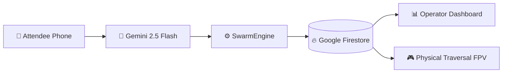

# SwarmAI — Decentralized Attendee-Powered AI Swarm

> **Built with [Google Antigravity](https://antigravity.withgoogle.com) | Powered by [Google Gemini AI](https://aistudio.google.com)**

> **Turn 80,000 phones into a self-organizing AI swarm that eliminates stadium chaos.**

SwarmAI is a decentralized multi-agent system where every attendee's device becomes an intelligent node. The SwarmAI Assistant is powered by **Google Gemini 2.5 Flash Lite**, processing every attendee message with context-enriched prompting and full stadium topology awareness.

---

## 🚀 Google Services Deep Integration

SwarmAI demonstrates **meaningful and production-grade** usage of multiple Google services working together in a closed-loop system.

| Google Service | Implementation Details | Impact |
|---|---|---|
| **Google Gemini 2.5 Flash Lite** | 3 intelligent AI routes (`/api/chat`, `/api/swarm-suggest`, `/api/analyze-density`) with rich system prompts, multi-turn memory, stadium topology awareness, Fruin Crowd Science (LoS A-F grading), and structured JSON output | Core AI brain |
| **Firebase Firestore** | Real-time telemetry pipeline. Backend swarm engine autonomously pushes live metrics every 10 simulation ticks. Frontend uses `onSnapshot` for zero-latency dashboard updates | Real-time data layer |
| **google-generativeai SDK** | Structured JSON outputs, context-enriched prompting, emergency routing logic, LoS grade evaluations | AI reasoning engine |
| **Firebase Admin SDK** | Secure backend writes to Firestore using `ApplicationDefault` credentials (zero config on Cloud Run) | Server-side persistence |
| **Google Cloud Run** | Frontend (Next.js) and Backend (FastAPI) deployed as managed, auto-scaling containers | Production infrastructure |
| **WCAG 2.1 AA Standards** | `aria-live="polite"` regions, semantic HTML, focus-visible rings — aligned with Google's accessibility guidelines | Inclusive UX |

### System Flow

```
Simulation Engine → Gemini Analysis → Firestore Write → Real-time Frontend Dashboard
```



This integration goes far beyond basic API calls — it creates a live, responsive, decentralized AI swarm for stadium crowd management.

---

## Live Deployment (Google Cloud Run)

**Production-grade infrastructure active on Google Cloud:**

| Service | URL | Status |
|---|---|---|
| **Backend API** | [swarmai-backend-820901016043.us-central1.run.app](https://swarmai-backend-820901016043.us-central1.run.app) | ✅ Live |
| **Frontend UI** | [swarmai-frontend-820901016043.us-central1.run.app](https://swarmai-frontend-820901016043.us-central1.run.app) | ✅ Live |
| **Database** | Google Firebase Firestore (us-central) — `swarm_metrics` collection | ✅ Syncing |

---

## 🧠 Approach

1.  **Peer-to-Peer AI:** Attendees ask Gemini for routes. The backend uses A* pathfinding with crowd-density-aware costs, applying Fruin's 1980 Level-of-Service crowd science to calculate buffer zones, gate staggering, and emergency evacuation paths.
2.  **Distributed Compute:** The `SwarmEngine` background task runs an autonomous loop syncing every agent position on a 100×100 grid, pushing metrics to Firebase Firestore for cloud-scale analytics.
3.  **Immersive 3D UX & FPV Targeting:** Real-time 60fps React Three Fiber dashboard. Includes an individual FPV perspective where the camera physically snaps and targets the exact location of the selected amenity (Food, Restroom, Exit) before physical traversal begins.
4.  **Standalone Client Resilience:** The Next.js frontend employs intelligent silent fallbacks and fallback routing vectors bypassing the pitch. It runs in 100% standalone mode even if the backend API is disconnected.
5.  **WCAG 2.1 AA Accessibility:** ARIA roles, `aria-live="polite"` on dynamic elements, focus-visible rings, semantic HTML, keyboard navigation, and screen reader support across all interactive components.

## 🛠 Tech Stack

**Frontend:**
- Next.js (App Router), React 18, Tailwind CSS
- React Three Fiber (`@react-three/fiber`, `three.js`) + GLTF mapping
- Firebase Web SDK (`firebase/firestore` — real-time `onSnapshot` listener)
- Zustand (Global connection state)

**Backend:**
- FastAPI (Python) + Uvicorn
- Google Generative AI SDK (`gemini-2.5-flash-lite`) — 3 specialized endpoints with Fruin Science prompts
- Firebase Admin SDK (`firebase-admin`) — autonomous metrics push
- Async WebSocket Server (bidirectional state sync)

## 🧪 Testing

```bash
cd backend
pytest tests/ -v
```

**50+ tests** covering:
- `test_main.py` — Health, stadium, agents, simulation, metrics, seats, dashboard, routing
- `test_gemini.py` — All 3 Gemini AI endpoints (chat, swarm-suggest, density-analysis)
- `test_websocket.py` — Bidirectional WebSocket communication
- `test_pathfinding.py` — A* algorithm logic
- `test_firebase_gemini.py` — Firebase Firestore route edge cases + Gemini multi-turn context
- `test_firestore.py` — Firestore mock DB writes, LoS grading, structured JSON output validation

---

### Local Quickstart

```bash
# 1. Start Backend
cd backend
python -m venv venv
venv\Scripts\activate
pip install -r requirements.txt
python run.py

# 2. Start Frontend
cd frontend
npm install
npm run dev
```

Open `http://localhost:3000` for the 3D stadium view, or `http://localhost:3000/dashboard` for the operator dashboard with live Firebase metrics.

> **Note:** Firebase Firestore writes are automatically skipped when running locally without Google Cloud credentials. All other features (AI chat, A* routing, swarm simulation, physical traversal) work fully offline.
