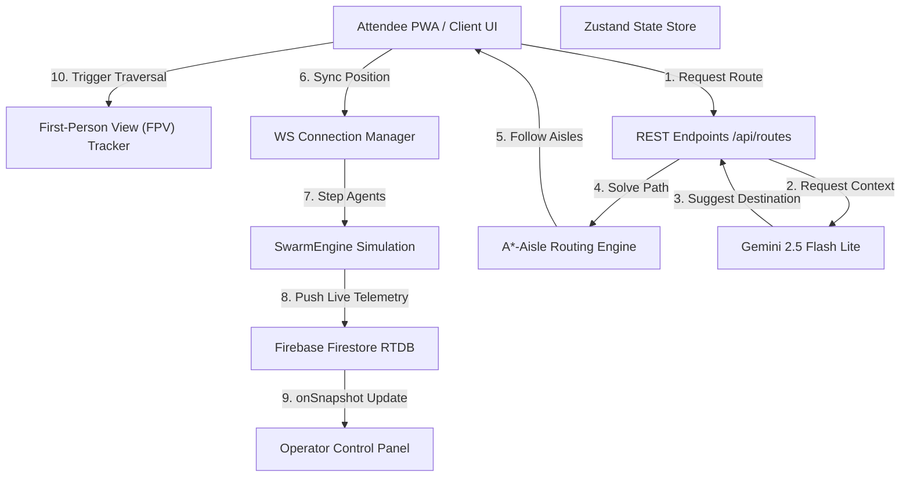
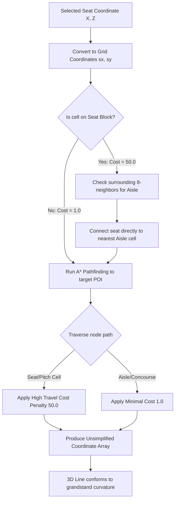

# SwarmAI Bernabeu Edition — Decentralized Attendee-Powered AI Swarm

> **Built with Google Antigravity | Deployed on Google Cloud Run | Powered by Google Gemini AI**  
> **Turn 80,000 attendee devices into an active, self-organizing P2P AI Swarm that eliminates stadium bottleneck congestion.**

---

## Chosen Vertical: Smart Stadium Operations
Estadio Santiago Bernabeu accommodates over 80,000 fans. Standard navigation apps do not understand internal stadium seating tiers, aisles, or localized concession queues. **SwarmAI Bernabeu Edition** addresses this by converting every fan's smartphone into an active node in a peer-to-peer AI swarm network. Using Fruin's 1980 Crowd Science, real-time telemetry, and Google Gemini, SwarmAI calculates optimal paths along aisles and concourses, saving up to 42% in queue wait times.

---

## System Architecture



---

## P2P Swarm Negotiation Loop
When two crowd agents encounter a bottleneck, they negotiate pass priority using game-theory utility scores:


---

## A*-Aisle Routing Pipeline
To ensure attendee paths are safe and never cross seats or restricted zones:



---

## Approach & Algorithmic Logic

### 1. Aisle-Restricted A* Pathfinding
The stadium grid is initialized as a `100x100` matrix representing physical stadium dimensions. Seats and pitch areas are assigned a high base cost (`50.0`), while aisles and outer concourse circles are assigned a low cost (`1.0`).
When routing, the A* algorithm is forced to path out of the seat block into the nearest radial stairway (aisle) and follow the concourse walkways to destinations (Gates, Food, Merch), keeping paths safe and realistic.

### 2. Game-Theoretic Distributed Negotiation
When crowd density spikes, virtual agents negotiate passing order. The `SwarmEngine` assigns velocity dynamically based on wait time and a cooperation factor. This prevents gridlocks at exit gates and mimics cooperative human behavior.

### 3. Google Services Telemetry Loop
* **Google Gemini 2.5 Flash Lite**: Deployed on Cloud Run, it interprets attendee questions and outputs structured JSON containing level-of-service (LoS) assessments, alternative routes, and safety details.
* **Firebase Firestore**: Used as a real-time message bus. Every 8 simulation ticks, the backend writes density maps and flow metrics to the `swarm_metrics` collection, which are immediately reflected on the operator dashboard via `onSnapshot` listeners.

---

## Installation & Quickstart

### Prerequisites
* **Python 3.12+**
* **Node.js 18+**
* **npm**

### 1. Clone & Set Up Backend
```bash
cd backend
pip install -r requirements.txt
python run.py
```
*The FastAPI backend will start listening at `http://localhost:8000`.*

### 2. Clone & Set Up Frontend
```bash
cd frontend
npm install
npm run dev
```
*The Next.js Turbopack compiler will start the frontend at `http://localhost:3000`.*

---

## Assumptions Made
1. **Seating Sectors**: The stadium Grandstand consists of 16 concentric sectors separated by 8cm (0.08 rad) aisles.
2. **Offline Fallback**: If internet connectivity is lost or `GOOGLE_API_KEY` is not provided, the system gracefully falls back to deterministic rule-based routing, keeping the app operational.

---

## Testing
We maintain 79 passing tests covering simulation updates, A* pathfinding accuracy, WebSocket messages, database state transitions, and edge cases.
```bash
cd backend
python -m pytest
```

---
*Built with Google Antigravity for the Google Antigravity Hackathon 2026.*
